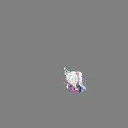

# <p align="center"><br/>影之诗点击特效 For 网页</span>

## 简述

在网页中模拟影之诗（SZB）的点击特效。就这么简单。

## 安装 / 应用

下载 `click-effect.css` 与 `click-effect.js` 两个源文件（或者下载 release 中的 `source-code.zip` 并解压），将其引入您的 HTML文件中。

代码示例：

```html
<link rel="stylesheet" type="text/css" href="./click-effect.css">

<script type="text/javascript" src="./click-effect.js"></script>
```
